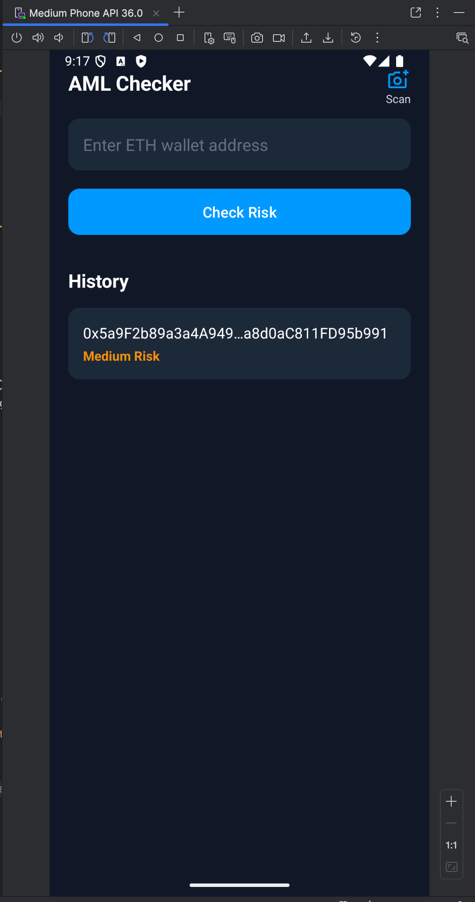

# MovieProject

## 1. Внедрение ViewModel и отделение логики от Activity

**Выполненные действия:**
*   В проект были добавлены зависимости Android Jetpack Lifecycle для `ViewModel` и `LiveData`.
*   Создан класс `MainViewModel`, унаследованный от `androidx.lifecycle.ViewModel`. Этот класс предназначен для хранения состояния UI и управления взаимодействием с бизнес-логикой.
*   В `MainActivity` экземпляр `MainViewModel` был получен с помощью `ViewModelProvider`. Такой подход гарантирует, что `ViewModel` "переживает" изменения конфигурации (например, поворот экрана), сохраняя свое состояние и предотвращая повторную загрузку данных.

## 2. Решение проблемы с зависимостями через ViewModelFactory

`MainViewModel` для своей работы требует зависимости (в данном случае, `MovieRepository`), которые, в свою очередь, могут требовать `Context`.

Была реализована **фабрика `ViewModelFactory`**:
*   Создан класс `ViewModelFactory`, реализующий интерфейс `ViewModelProvider.Factory`.
*   Фабрика принимает `Context` в свой конструктор и использует его для создания всей цепочки зависимостей (`SharedPrefMovieStorage` -> `MovieRepositoryImpl`).
*   Метод `create()` фабрики отвечает за ручное конструирование `MainViewModel` и передачу в него всех необходимых зависимостей.
*   В `MainActivity` `ViewModelProvider` был инициализирован с использованием этой фабрики, что позволило полностью изолировать `ViewModel` от `Context` и деталей создания ее зависимостей.

## 3. Создание реактивного UI с помощью LiveData

Для автоматического обновления интерфейса при изменении данных был использован компонент **`LiveData`**.

**Выполненные действия:**
*   В `MainViewModel` состояние (название любимого фильма) было обернуто в `MutableLiveData<String>`.
*   Методы `saveMovie()` и `loadMovie()` во `ViewModel` были изменены: теперь они не возвращают результат напрямую, а обновляют значение внутри `LiveData` с помощью метода `setValue()`.
*   В `MainActivity` была создана подписка на `LiveData` с помощью метода `.observe()`. Внутри колбэка `onChanged()` происходит обновление `TextView` каждый раз, когда данные во `ViewModel` изменяются.
*   Обработчики нажатий кнопок в `MainActivity` были упрощены: теперь они лишь делегируют действия пользователя соответствующим методам `MainViewModel`.

### Итог

В результате проделанной работы слой Presentation был успешно переведен на архитектуру MVVM.
*   **View (`MainActivity`)** стала максимально "глупой", отвечая только за отображение данных и передачу событий.
*   **ViewModel (`MainViewModel`)** стала единственным источником состояния для View и центральным узлом для обработки UI-логики.
*   **Реактивность**, обеспеченная `LiveData`, позволила избавиться от ручного обновления UI и сделала код более чистым и предсказуемым.

---

# AML Checker

В рамках данной практической работы была произведена полная модернизация слоя Presentation (модуль `:app`). Целью было внедрение архитектурного паттерна **MVVM (Model-View-ViewModel)** и создание современного, реактивного пользовательского интерфейса с помощью компонентов Android Jetpack Lifecycle (`ViewModel`, `LiveData`, `MediatorLiveData`).

## 1. Внедрение ViewModel во все Activity

Для строгого разделения UI-логики от логики отображения, все `Activity` проекта (`LoginActivity`, `RegisterActivity`, `MainActivity`) были переведены на паттерн MVVM.

**Выполненные действия:**
*   Для каждого экрана был создан соответствующий `ViewModel`-класс (`LoginViewModel` и т.д.), наследуемый от `androidx.lifecycle.ViewModel`.
*   Вся бизнес-логика и управление состоянием были перенесены из `Activity` во `ViewModel`. `Activity` теперь отвечают только за отображение данных и передачу действий пользователя в `ViewModel`.
*   Была реализована единая фабрика `ViewModelFactory`, отвечающая за создание всех `ViewModel`-классов и корректное внедрение в них зависимостей (Use Cases, Repositories). Этот подход позволил полностью изолировать `ViewModel` от `Context` и деталей создания объектов.

## 2. Реализация реактивного интерфейса с помощью LiveData

Для автоматического обновления UI при изменении данных был использован компонент **`LiveData`**. Это позволило уйти от ручных вызовов обновления интерфейса и сделать код более чистым и надежным.

**Выполненные действия:**
*   Во всех `ViewModel`-классах состояние экрана (например, статус загрузки, список истории, результат авторизации) было обернуто в `MutableLiveData`.
*   `Activity` подписываются на эти `LiveData`-объекты с помощью метода `.observe()`. Код в подписчике автоматически выполняется каждый раз при изменении данных, обновляя соответствующие элементы UI (например, `ProgressBar` или `RecyclerView`).
*   Это обеспечило однонаправленный поток данных (Unidirectional Data Flow): `View` -> `ViewModel` -> `Model`, а затем `Model` -> `ViewModel` -> `View` (через `LiveData`), что делает поведение приложения предсказуемым и легко отлаживаемым.

## 3. Изучение и применение MediatorLiveData

Был изучен и применен компонент **`MediatorLiveData`** для решения сложной задачи по объединению данных из нескольких асинхронных источников.

**Задача:** При проверке нового кошелька необходимо было мгновенно показать его результат вверху списка истории, не дожидаясь, пока он сохранится в базу данных и придет оттуда с общим списком.

**Реализация:**
*   Слой данных был сделан реактивным: `WalletCheckDao` теперь возвращает `LiveData<List<...>>`, который автоматически обновляется при изменениях в БД.
*   В `MainViewModel` был создан `MediatorLiveData`, который "слушает" два источника:
    1.  `LiveData<List<WalletCheck>>` — постоянный поток данных из базы данных Room.
    2.  `MutableLiveData<WalletCheck>` — временный поток для одного, свежего результата из сети.
*   `MediatorLiveData` объединяет данные из этих двух источников: он берет основной список из БД и добавляет к нему сверху свежий результат из сети, формируя финальный, объединенный список для отображения в `RecyclerView`.

## Скриншоты

