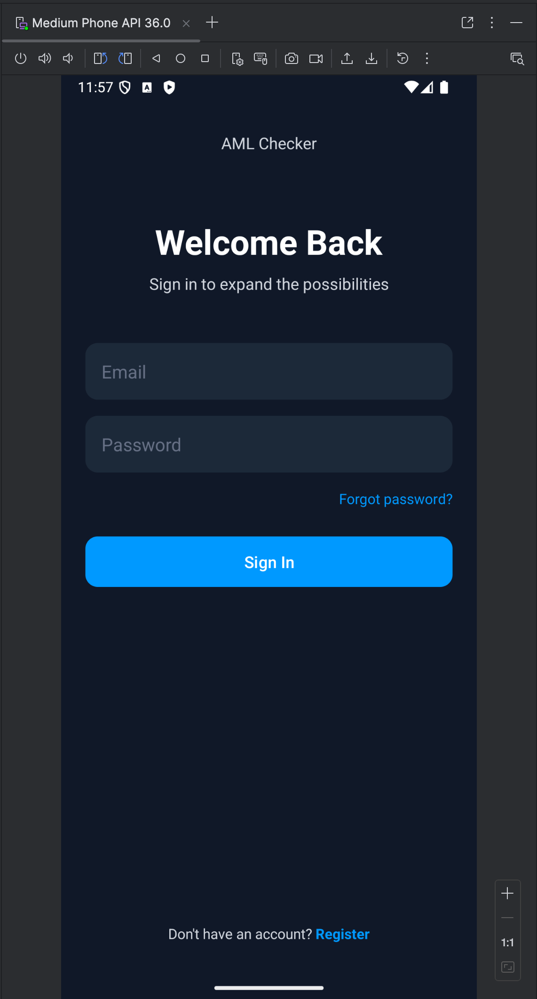

## Описание выполненных заданий

### 1. Рефакторинг слоя данных и выделение хранилища

Первым шагом был выполнен рефакторинг класса `MovieRepositoryImpl`. Изначально он напрямую работал с `SharedPreferences`, что нарушало Принцип единственной ответственности.

**Выполненные действия:**
*   Создан интерфейс `MovieStorage`, описывающий контракт для любого хранилища данных (`get`, `save`).
*   Создан класс `SharedPrefMovieStorage`, реализующий данный интерфейс и инкапсулирующий всю логику работы с `SharedPreferences`.
*   Класс `MovieRepositoryImpl` был изменен таким образом, что он больше не работает с хранилищем напрямую, а делегирует эту задачу экземпляру `MovieStorage`, получаемому через конструктор.

### 2. Разделение моделей данных и реализация маппинга

Для строгого разделения слоев и их данных были созданы две независимые модели `Movie`:
*   **`domain.models.Movie`**: Простая POJO-модель, содержащая только поля, необходимые для бизнес-логики (`id`, `name`).
*   **`data.storage.models.Movie`**: Модель для слоя данных, содержащая дополнительные служебные поля, такие как дата сохранения.

Для преобразования моделей между слоями в `MovieRepositoryImpl` были реализованы приватные методы-мапперы: `mapToStorage()` и `mapToDomain()`.

### 3. Преобразование проекта в многомодульную архитектуру

Ключевым этапом работы стало преобразование логических пакетов `data` и `domain` в физически разделенные Gradle-модули.

**Выполненные действия:**
*   Создан Gradle-модуль **`:domain`** типа `Java/Kotlin Library`. Он не содержит зависимостей от Android SDK и является ядром приложения.
*   Создан Gradle-модуль **`:data`** типа `Android Library`, так как ему требуется `Context` для работы с `SharedPreferences`.
*   Весь соответствующий код был перенесен из основного модуля `:movieproject` в новые модули.
*   Настроены межмодульные зависимости в `build.gradle` файлах:
    *   `:movieproject` зависит от `:data` и `:domain`.
    *   `:data` зависит от `:domain`.
    *   `:domain` не зависит ни от каких других модулей проекта.

## Скриншоты

---

## 1. Прототипирование интерфейса в Figma

На первом этапе был разработан прототип пользовательского интерфейса в Figma.

**Были спроектированы следующие экраны:**
*   **Splash Screen:** Стартовый экран для проверки статуса авторизации.
*   **Login & Register Screens:** Экраны для входа и создания нового аккаунта.
*   **Main Screen (Guest):** Главный экран для неавторизованного пользователя с ограниченным функционалом.
*   **Main Screen (Authenticated):** Полнофункциональный главный экран для авторизованного пользователя с доступом к истории проверок.

## 2. Создание многомодульной архитектуры

**Были созданы и настроены следующие Gradle-модули:**
*   **:domain**: Содержит ядро бизнес-логики: модели данных (Entities), интерфейсы репозиториев и сценарии использования (Use Cases). Этот модуль не имеет зависимостей от Android SDK и других модулей проекта.
*   **:data**: Содержит конкретные реализации интерфейсов из `:domain`. Отвечает за работу с внешними источниками: сетью, базой данных, SharedPreferences. Зависит от модуля `:domain`.
*   **:app**: Содержит слой представления (UI): Activities, Fragments, Adapters. Зависит от модулей `:data` и `:domain`.

## 3. Реализация системы авторизации с Firebase

Для управления пользователями была интегрирована система **Firebase Authentication**.

*   **В слое `domain`:** Созданы абстракции для работы с авторизацией: интерфейс `AuthRepository` и колбэк `AuthCallback`, а также `UseCase`-классы (`LoginUseCase`, `RegisterUseCase`, `CheckUserLoggedInUseCase`).
*   **В слое `data`:** Создан класс `AuthRepositoryImpl`, который реализует интерфейс `AuthRepository` и содержит всю логику асинхронных запросов к Firebase.
*   **В слое `presentation` (`app`):** Созданы `LoginActivity` и `RegisterActivity`. Эти классы взаимодействуют **только** с `UseCase`-классами из доменного слоя, не имея прямого доступа к репозиторию.

## 4. Реализация трёх способов обработки данных в репозитории

В соответствии с заданием, `WalletRepositoryImpl` был реализован как "мозговой центр", координирующий работу с тремя различными источниками данных:

1.  **SharedPreferences (информация о клиенте):** Создан класс `ClientInfoStorage` для хранения простой key-value информации (например, настроек или email пользователя).
2.  **Room (локальная база данных):** Реализована полноценная работа с СУБД Room для персистентного хранения истории проверок кошельков. Были созданы все необходимые компоненты: `@Entity`, `@Dao` и `@Database`.
3.  **NetworkApi (замоканные данные):** Создан интерфейс `NetworkApi` и его фейковая реализация `MockNetworkApi`. Этот класс имитирует обращение к внешнему серверу, включая задержку и генерацию случайных данных.

Методы `WalletRepositoryImpl` (`checkWallet` и `getCheckHistory`) теперь используют эти источники для выполнения своих задач: `checkWallet` получает данные из `NetworkApi` и сохраняет их в `Room`, а `getCheckHistory` извлекает всю историю из `Room`. Вся работа с базой данных и сетью выполняется в фоновых потоках для предотвращения блокировки UI.

## Скриншоты

#### Прототип и дизайн

#### Архитектура и авторизация

#### Работа приложения

