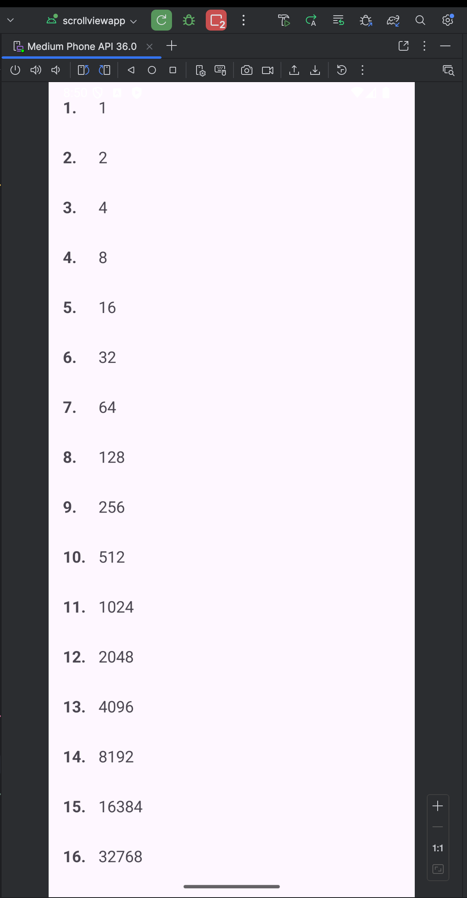
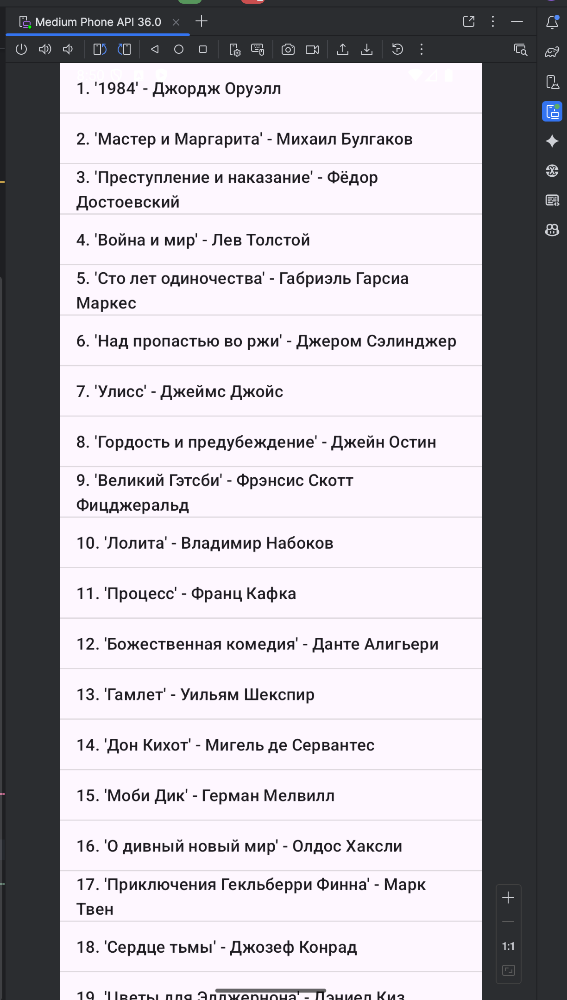

## 1. Отображение списка с помощью ScrollView

**Задание:** Создать новый модуль `ScrollViewApp` и отобразить в нём геометрическую прогрессию со знаменателем 2, содержащую 100 элементов.

**Реализация:**
1.  Был создан новый модуль `ScrollViewApp` с `Empty Views Activity`.
2.  В файле `activity_main.xml` был размещен компонент `ScrollView`, содержащий внутри себя `LinearLayout` с вертикальной ориентацией в качестве единственного дочернего элемента-контейнера.
3.  Разработан отдельный layout-файл `item_layout.xml` для представления одной строки списка, содержащий два `TextView` для порядкового номера и значения.
4.  В `MainActivity.java` в цикле от 1 до 100 были выполнены следующие действия:
    *   Программно "надувался" (inflate) экземпляр `item_layout.xml` с помощью `LayoutInflater`.
    *   Вычислялся очередной член геометрической прогрессии.
    *   Полученные данные устанавливались в соответствующие `TextView`.
    *   Готовый `View`-элемент добавлялся в `LinearLayout` с помощью метода `addView()`.

## 2. Отображение списка с помощью ListView

**Задание:** Создать новый модуль `ListViewApp` и отобразить список из более чем 30 авторов и книг.

**Реализация:**
1.  Был создан новый модуль `ListViewApp` с `Empty Views Activity`.
2.  В `activity_main.xml` был размещен компонент `ListView`, занимающий весь экран.
3.  В `MainActivity.java` был создан строковый массив (`String[]`), содержащий список из 31 книги с авторами.
4.  Для связи данных с `ListView` был использован стандартный `ArrayAdapter<String>`. В конструктор адаптера были переданы:
    *   Текущий контекст (`this`).
    *   Стандартный системный layout для одного текстового элемента (`android.R.layout.simple_list_item_1`).
    *   Массив с данными.
5.  Созданный адаптер был установлен для `ListView` с помощью метода `setAdapter()`.

## 3. Контрольное задание: Интеграция RecyclerView в MVVM-архитектуру

**Задание:** В репозитории создать заглушку с набором данных, передать эти данные в слой представления с помощью `LiveData` и отобразить их в `RecyclerView`.

**Реализация:**
Поскольку в ходе предыдущих практических работ уже была выстроена полноценная многомодульная MVVM-архитектура, задача свелась к корректной интеграции `RecyclerView` в существующую систему.

### 3.1. Подготовка слоя данных и ViewModel

*   **Репозиторий:** `WalletRepositoryImpl` уже был реализован с использованием "заглушки" (`MockNetworkApi`) для сетевых запросов и `Room` для хранения истории. Таким образом, репозиторий полностью готов к предоставлению данных.
*   **ViewModel:** `MainViewModel` уже использовал `LiveData` (и `MediatorLiveData`) для управления состоянием UI. Метод `getHistoryToDisplay()` возвращает `LiveData<List<WalletCheck>>`, который является реактивным источником данных для `RecyclerView`. `ViewModel` автоматически получает данные из `Repository` через `UseCases` при создании экрана и обновляет их после каждой новой проверки.

### 3.2. Реализация Adapter'а для RecyclerView

Для связи данных `WalletCheck` с `View`-элементами был создан класс `HistoryAdapter`, наследуемый от `RecyclerView.Adapter`.

*   **`HistoryViewHolder`**: Реализован внутренний класс-холдер, который кэширует ссылки на `TextView` для адреса и уровня риска, что предотвращает избыточные вызовы `findViewById()` и повышает производительность.
*   **`onCreateViewHolder()`**: "Надувает" макет `history_item.xml` для создания нового элемента списка.
*   **`onBindViewHolder()`**: Связывает данные из объекта `WalletCheck` с `View`-элементами холдера. Здесь же реализована логика по окрашиванию текста уровня риска в разные цвета (красный, оранжевый, зеленый) в зависимости от значения `riskScore`.
*   **`setHistoryList()`**: Создан публичный метод, который принимает новый список данных, обновляет внутреннее состояние адаптера и вызывает `notifyDataSetChanged()` для перерисовки `RecyclerView`.

### 3.3. Интеграция в MainActivity

В `MainActivity` была произведена финальная сборка всех компонентов для экрана авторизованного пользователя.

*   В методе `setupAuthenticatedUI()`:
    1.  `RecyclerView` из layout-файла инициализируется и настраивается с `LinearLayoutManager`.
    2.  Создается и устанавливается экземпляр `HistoryAdapter`.
    3.  Создается подписка на `LiveData<List<WalletCheck>>` из `MainViewModel` с помощью метода `.observe()`. Внутри колбэка этой подписки вызывается метод `historyAdapter.setHistoryList()`, что обеспечивает **автоматическое и реактивное обновление списка** при любом изменении данных во `ViewModel`.
