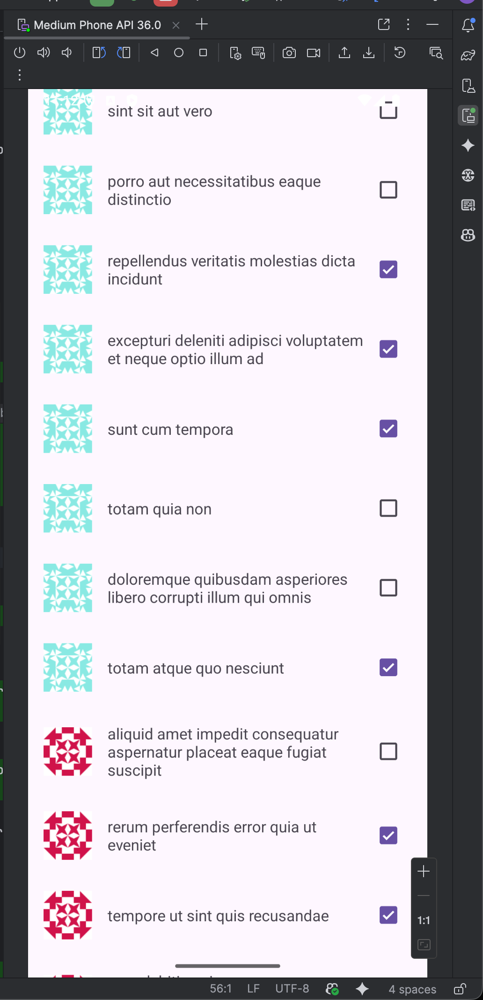
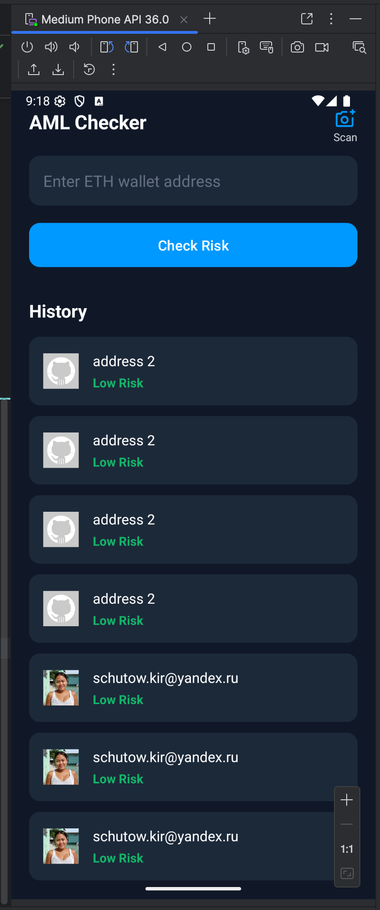

## 1. Реализация получения данных с помощью Retrofit

**Задание:** Создать приложение, позволяющее просматривать список дел (`Todo`) и статус их выполнения, получая данные с публичного API `jsonplaceholder.typicode.com`.

**Реализация:**
1.  **Настройка проекта:** В новый модуль `RetrofitApp` были добавлены зависимости для `Retrofit` и `Gson Converter`, а также разрешение `android.permission.INTERNET` в манифест.
2.  **Модель данных (POJO):** Был создан класс `Todo.java`, структура которого полностью соответствует JSON-объекту, возвращаемому сервером. Для корректной десериализации использовались аннотации `@SerializedName` и `@Expose` из библиотеки Gson.
3.  **API-интерфейс:** Был создан интерфейс `ApiService.java`, в котором с помощью аннотации `@GET("todos")` был описан GET-запрос для получения списка всех дел.
4.  **Настройка Retrofit и выполнение запроса:** В `MainActivity` был сконфигурирован и создан экземпляр `Retrofit` с указанием базового URL и `GsonConverterFactory`. Запрос выполнялся асинхронно с помощью метода `.enqueue()`.
5.  **Обработка ответа:** В колбэках `onResponse()` и `onFailure()` была реализована логика обработки ответа от сервера. В случае успешного ответа (`response.isSuccessful()`) полученный список объектов `Todo` передавался в `RecyclerView.Adapter`. В случае сетевой ошибки или ошибки сервера, пользователю выводилось соответствующее уведомление через `Toast`.
6.  **Отображение данных:** Для отображения списка был использован `RecyclerView` с кастомным `TodoAdapter`, который связывал данные (название и статус `Todo`) с элементами `TextView` и `CheckBox` в макете для одной строки.

## 2. Отправка обновлений на сервер (PUT/PATCH)

**Задание:** Добавить в приложение отправку запроса на обновление `Todo` при изменении состояния `CheckBox`.

**Реализация:**
1.  **Расширение API-интерфейса:** В `ApiService` был добавлен новый метод `updateTodo()` с аннотацией `@PATCH("todos/{id}")`. Метод принимает `id` обновляемого элемента (через аннотацию `@Path`) и сам объект `Todo` с новыми данными (через аннотацию `@Body`).
2.  **Модификация Adapter'а:** В `TodoAdapter` на `CheckBox` был установлен слушатель `setOnCheckedChangeListener`. При срабатывании этого слушателя:
    *   Создается новый объект `Todo` с обновленным статусом `completed`.
    *   Вызывается метод `apiService.updateTodo()`, который асинхронно отправляет `PATCH`-запрос на сервер.
    *   В колбэках `onResponse()`/`onFailure()` обрабатывается результат обновления. В случае неудачи, состояние `CheckBox` возвращается в исходное положение, чтобы UI оставался консистентным с данными на сервере.

## 3. Загрузка изображений с помощью Picasso

**Задание:** Изменить разметку, добавить `ImageView` и реализовать загрузку изображений из интернета с настройкой параметров отображения.

**Реализация:**
1.  **Настройка проекта:** В проект была добавлена зависимость библиотеки `Picasso`.
2.  **Модификация UI:** В макет элемента списка `item_todo.xml` был добавлен `ImageView` для отображения аватара.
3.  **Интеграция в Adapter:** В методе `onBindViewHolder()` класса `TodoAdapter` была добавлена логика загрузки изображений:
    *   С помощью `Picasso.get().load(imageUrl).into(imageView)` реализована асинхронная загрузка изображения по URL. В качестве URL использовался сервис Gravatar для генерации уникальных аватаров на основе `userId`.
    *   Были настроены параметры отображения: с помощью методов `.placeholder()` и `.error()` были установлены изображения-заглушки, которые отображаются во время загрузки и в случае ошибки соответственно.

## Скриншоты

---

## 1. Настройка и реализация сетевого слоя с Retrofit

**Задание:** Реализовать получение сущностей из сети с помощью Retrofit.

**Реализация:**
1.  **Настройка API-сервера:** Для имитации реального бэкенда был использован сервис `mockapi.io`. Был создан эндпоинт `/wallet_history`, возвращающий список объектов со структурой, включающей `address`, `riskScore`, `checkDate` и `currencyIconUrl`.

2.  **Интеграция Retrofit в слой `:data`:**
    *   В `build.gradle` модуля `:data` были добавлены зависимости для `Retrofit` и `Gson Converter`.
    *   **DTO (Data Transfer Object):** Создан класс `WalletCheckDto` в пакете `data/network/dto`, структура которого точно соответствует JSON-ответу от `mockapi.io`. Это позволило отделить "грязную" сетевую модель от "чистой" доменной.
    *   **API-интерфейс:** Создан интерфейс `AmlApiService`, в котором с помощью аннотаций Retrofit (`@GET`, `@POST`, `@Body`) были декларативно описаны все необходимые сетевые запросы (`getHistory`, `checkWallet`).

3.  **Реализация `NetworkApi`:**
    *   Был создан класс `RetrofitNetworkApi`, реализующий "чистый" интерфейс `NetworkApi` из доменного слоя.
    *   Внутри этого класса был сконфигурирован экземпляр `Retrofit` с указанием базового URL и `GsonConverterFactory`.
    *   Методы `checkAddress()` и `getHistory()` выполняют **синхронные** сетевые запросы (`.execute()`), так как они вызываются из фонового потока, управляемого `ViewModel`.
    *   Внутри этих методов реализован **маппинг** — преобразование полученных `WalletCheckDto` в доменные модели `WalletCheck` перед возвратом результата в `Repository`.

4.  **Внедрение в архитектуру:** В `ViewModelFactory` (модуль `:app`) экземпляр `MockNetworkApi` был заменен на `new RetrofitNetworkApi()`.

## 2. Интеграция загрузки изображений с Picasso

**Задание:** Реализовать отображение изображений, полученных из сети, с помощью Picasso, Coil или Glide.

**Реализация:**
1.  **Настройка проекта:** В `build.gradle` модуля `:app` была добавлена зависимость библиотеки `Picasso`.
2.  **Обновление моделей:** В доменную модель `WalletCheck` и модель базы данных `WalletCheckDbo` было добавлено поле `currencyIconUrl` для хранения URL изображения.
3.  **Модификация UI:** В макет элемента списка `history_item.xml` был добавлен `ImageView` для отображения иконки.
4.  **Интеграция в `HistoryAdapter`:**
    *   В методе `onBindViewHolder` была добавлена логика асинхронной загрузки изображений.
    *   С помощью `Picasso.get().load(url).into(imageView)` изображение загружается по URL, полученному из объекта `WalletCheck`.

## Скриншоты

