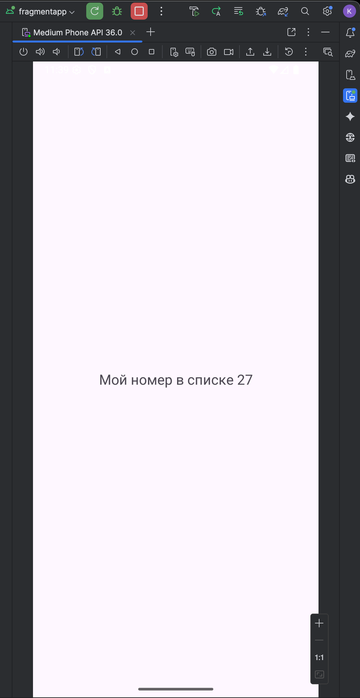
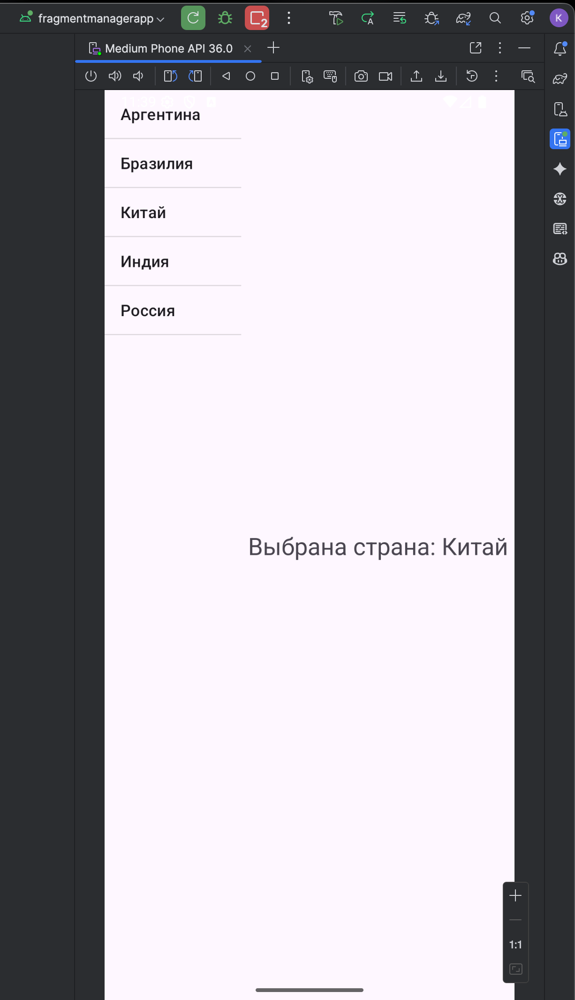
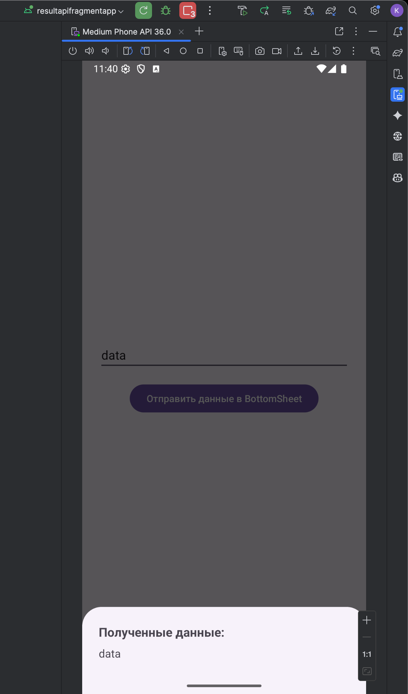
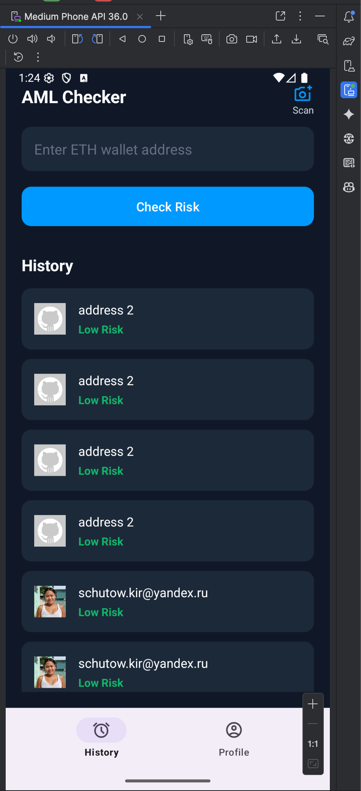
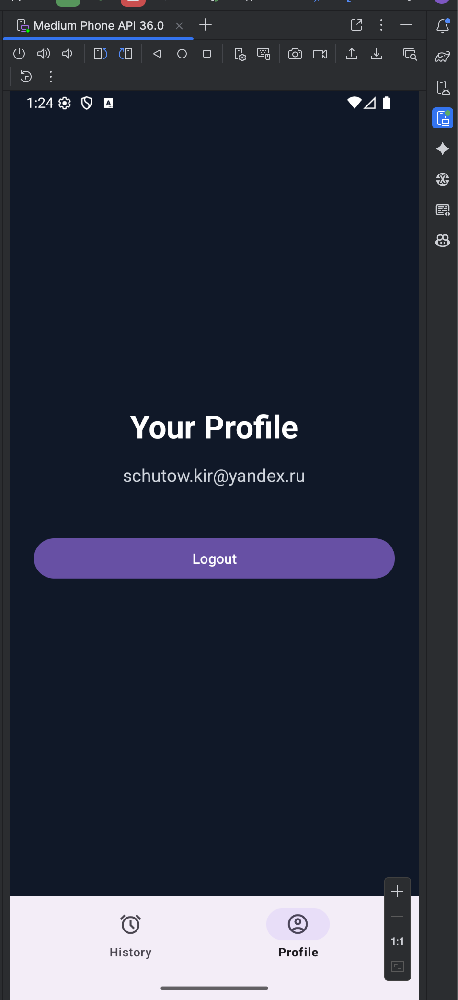

## 1. Основы работы с Fragment (`FragmentApp`)

**Задание:** Создать приложение с одним фрагментом, динамически добавить его в `Activity` и передать в него данные (номер по списку) через `Bundle`.

**Реализация:**
1.  Был создан новый модуль `FragmentApp`.
2.  С помощью шаблона `Fragment (Blank)` был создан `BlankFragment` и его layout-файл.
3.  В `activity_main.xml` был размещен `FragmentContainerView` в качестве контейнера для фрагмента.
4.  В `MainActivity` была реализована логика для динамического добавления фрагмента:
    *   Транзакция выполняется только при первом создании `Activity` (проверка `savedInstanceState == null`).
    *   Данные (номер по списку) были упакованы в `Bundle`.
    *   Для создания экземпляра фрагмента с аргументами был использован фабричный метод `newInstance()`.
    *   С помощью `getSupportFragmentManager().beginTransaction().add(...).commit()` фрагмент был добавлен в контейнер.
5.  В `BlankFragment`, в методе `onViewCreated()`, переданные данные были извлечены из `Bundle` с помощью `getArguments()` и выведены в Logcat и на экран.

## 2. Взаимодействие фрагментов через SharedViewModel (`FragmentManagerApp`)

**Задание:** Реализовать паттерн "Master-Detail" с двумя фрагментами на одном экране, где выбор элемента в одном фрагменте вызывает обновление другого.

**Реализация:**
1.  Был создан новый модуль `FragmentManagerApp`.
2.  Разработаны два фрагмента: `ListFragment` (со списком стран) и `DetailsFragment` (для отображения деталей).
3.  Создан класс `SharedViewModel`, содержащий `MutableLiveData<String>` для хранения информации о выбранном элементе.
4.  Оба фрагмента получают **один и тот же экземпляр** `SharedViewModel`, привязанный к жизненному циклу родительской `Activity` (через `new ViewModelProvider(requireActivity()).get(...)`).
5.  `ListFragment` по клику на элемент списка вызывает метод `select()` во `ViewModel`, обновляя значение в `LiveData`.
6.  `DetailsFragment` подписывается (`.observe()`) на `LiveData` из `SharedViewModel`. При изменении данных `TextView` во фрагменте обновляется автоматически.

## 3. Передача разовых результатов через Fragment Result API (`ResultApiFragmentApp`)

**Задание:** Реализовать передачу данных из одного фрагмента в другой с помощью `Fragment Result API`.

**Реализация:**
1.  Был создан новый модуль `ResultApiFragmentApp`.
2.  Разработаны два фрагмента: `DataFragment` (отправитель, с `EditText` и кнопкой) и `MyBottomSheetFragment` (получатель, диалоговый фрагмент).
3.  **В фрагменте-получателе (`MyBottomSheetFragment`):** В методе `onViewCreated()` был установлен слушатель результата с помощью `getParentFragmentManager().setFragmentResultListener("requestKey", ...)`. Слушатель ожидает результат с определенным ключом и, получив его, отображает данные.
4.  **В фрагменте-отправителе (`DataFragment`):** По нажатию на кнопку:
    *   Данные из `EditText` упаковываются в `Bundle`.
    *   Открывается `MyBottomSheetFragment`.
    *   С помощью `getChildFragmentManager().setFragmentResult("requestKey", bundle)` результат отправляется "вверх" по иерархии `FragmentManager`.

## Скриншоты

---

В ходе выполнения практической работы была произведена полная реструктуризация пользовательского интерфейса приложения "AML Crypto Check". Целью было перейти от традиционной модели "один экран = одна Activity" к **Фрагменты (`Fragment`)** для реализации отдельных экранов.

## 1. Преобразование `MainActivity` в навигационный хост

**Выполненные действия:**
*   Вёрстка `MainActivity` была полностью переработана. Теперь она содержит два основных элемента: `FragmentContainerView` для отображения контента и `BottomNavigationView` для навигации.
*   Вся UI-логика (отображение списка, обработка кликов) была удалена из `MainActivity`.
*   В `MainActivity.java` была реализована логика переключения фрагментов. Установлен слушатель `setOnItemSelectedListener` на `BottomNavigationView`, который в зависимости от выбранного пункта меню заменяет текущий фрагмент в `FragmentContainerView` с помощью транзакции `getSupportFragmentManager().beginTransaction().replace(...)`.

## 2. Реализация экранов с помощью Фрагментов

Все основные экраны приложения для авторизованного пользователя были реализованы в виде независимых и переиспользуемых фрагментов.

#### 2.1. `HistoryFragment`
*   Вся вёрстка и логика, ранее находившаяся в `MainActivity` и отвечавшая за отображение списка истории проверок (`RecyclerView`, `Adapter`, `EditText` для ввода адреса), были полностью перенесены в `HistoryFragment` и его layout-файл `fragment_history.xml`.
*   Фрагмент получает собственный экземпляр `MainViewModel` (привязанный к его жизненному циклу) через `ViewModelFactory` и подписывается на `LiveData` для получения и отображения данных.

#### 2.2. `ProfileFragment`
*   Был создан новый экран "Профиль" в виде `ProfileFragment`.
*   Для него была разработана собственная `ProfileViewModel`, отвечающая за получение данных о текущем пользователе и обработку выхода из аккаунта.
*   На экране отображается email авторизованного пользователя, полученный из `ProfileViewModel`.
*   Реализована кнопка "Logout", которая через `ViewModel` вызывает метод `authRepository.logout()` и выполняет перенаправление на `LoginActivity`, корректно завершая сессию пользователя и очищая стек навигации.

## 3. Управление навигацией и Back Stack

Для обеспечения интуитивно понятной навигации был использован **Back Stack** (`стек обратного вызова`).

*   При каждой транзакции по замене фрагмента (`.replace(...)`) она добавляется в Back Stack с помощью метода `.addToBackStack(null)`.
*   Это позволяет пользователю перемещаться между открытыми экранами (`HistoryFragment` и `ProfileFragment`) с помощью системной кнопки "назад", не выходя из приложения.

