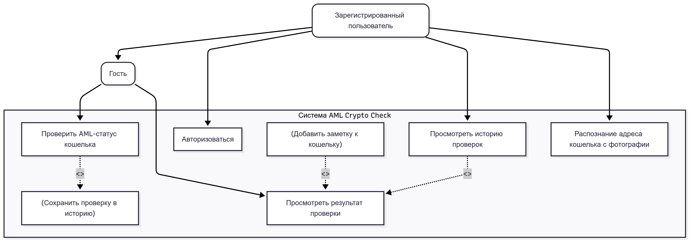

## Описание выполненных заданий

### 1. Проектирование архитектуры приложения ("AML Crypto Check")

В рамках первого этапа была спроектирована архитектура для мобильного приложения **"AML Crypto Check"** — сервиса для AML-проверки криптовалютных кошельков в сети ETH.

Были определены ключевые участники системы (акторы) и их возможности:
*   **Гость:** Может выполнять ограниченное количество проверок.
*   **Зарегистрированный пользователь:** Имеет доступ к истории проверок и дополнительному функционалу.

### 2. Декомпозиция приложения на слои

На основе спроектированной диаграммы была выполнена декомпозиция приложения на три основных архитектурных слоя с четким разделением зон ответственности.

### 3. Реализация сохранения данных с помощью SharedPreferences

В рамках проекта `MovieProject` было сделано сохранение данных с использованием `SharedPreferences` в соответствии с принципами Clean Architecture.

Ключевая задача состояла в том, чтобы слой `domain` оставался "чистым" и не имел зависимостей от Android SDK (`Context`). Задача была решена путем передачи `Context` через **конструктор** класса `MovieRepositoryImpl` в слое `data`, что позволило инкапсулировать всю логику работы с Android-фреймворком внутри слоя данных.

### 4. Контрольное задание: создание каркаса проекта "AML Crypto Check"

В соответствии с заданием, был создан проект-болванка ("каркас") для приложения "AML Crypto Check", реализующий спроектированную архитектуру.

**Была создана следующая структура классов:**

*   **В слое `domain`:**
    *   `model/WalletCheck.java`: Класс-сущность, описывающий результат проверки.
    *   `repository/WalletRepository.java`: Интерфейс-контракт для работы с данными.
    *   `usecase/CheckWalletUseCase.java`: Сценарий для проверки кошелька.
    *   `usecase/GetCheckHistoryUseCase.java`: Сценарий для получения истории проверок.

*   **В слое `data`:**
    *   `repository/WalletRepositoryImpl.java`: Класс, реализующий интерфейс `WalletRepository`.

Реализация репозитория на данном этапе возвращает **статичные тестовые данные**, имитируя ответы от API и базы данных, что полностью соответствует требованиям контрольного задания.

## Скриншоты

